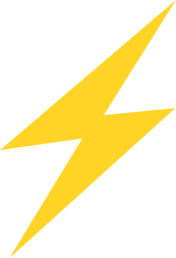

### Here are some projects that you might want to see;

#### Projects

[GitHub Manager Explore](https://github.com/joaomede/github-manager-explore) - 
(
 -
 -  - 
 -
 - 

) "Composition-API - TSX"  
[Api Doc](https://github.com/joaomede/Api-Doc) - 
(
 - 
 - 
 - 
 - 
 -

)  
[Auto Docker Deploy](https://github.com/joaomede/Auto-Deploy-Docker) - 
(
 -
 - 
 - 
 - 
 - 
 - 

)  
[ChecklistPessoal-Quasar](https://github.com/joaomede/ChecklistPessoal-Quasar) - 
(
 - 
 - 
 - 

)  
[QuickStart Vuejs 3 TSX](https://github.com/joaomede/QuickStart-Vuejs-3-TSX) - 
(
 - 

) "TSX"  
[Docker Monitor (Azure Function)](https://github.com/joaomede/docker-monitor-azure-function) - (
 - 
 - 

)

#### Libs

[Api Doc - JS SDK](https://github.com/joaomede/api-doc-js-sdk) - 
(
 - 
 - 
 - 
 - 
 - 

)  
[Resp-Express](https://github.com/joaomede/resp-express) - (
 - 
 - 
 - 
 - 
Test Unit - 
Test Integration - 
ExpressJS
)  
[Juno-Payments](https://github.com/joaomede/juno-payments) - (
 - 
 - 
 - 

) "Wrapper Plataforma de Pagamento"  

#### Simple Examples

[Vue CDN CRUD Example - (With Reactivity in Depth)](https://github.com/joaomede/Vue-CDN-Vuetify-CrudExample) - 
(
 - 
 - 
 - 
CDN - 
DataTable - 
Reactivity in Depth Concept
)

### About ME

-   🌱 I like to study several things, like frontend technologies and new frontend / backend approaches, I like to look for new things and learn about them.
-   📫 joaoserj@gmail.com
-   :houses: https://joaomede.github.io/
-   😄 Pronouns: Eng: He - PT: Ele
-   👯 I’m looking to collaborate on unit tests, integration tests, vuejs frontend projects and API's Rest / Graph

<!--
**joaomede/joaomede** is a ✨ _special_ ✨ repository because its `README.md` (this file) appears on your GitHub profile.

Here are some ideas to get you started:

- 🔭 I’m currently working on ...
- 🌱 I’m currently learning ...
- 👯 I’m looking to collaborate on ...
- 🤔 I’m looking for help with ...
- 💬 Ask me about ...
- 📫 How to reach me: ...
- 😄 Pronouns: ...
- ⚡ Fun fact: ...
-->
